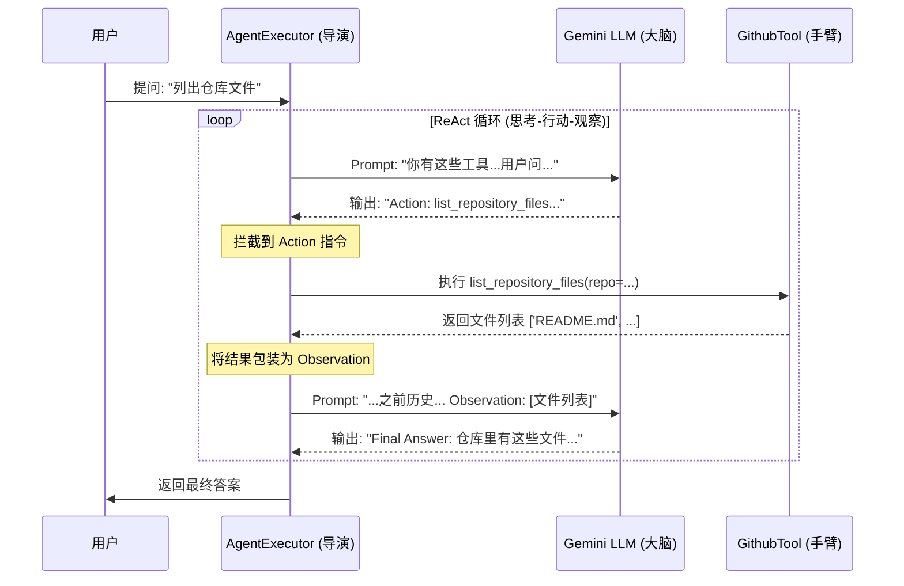

# LangChain Agent 调用工具的实现原理揭秘

本文档详细解析了在本项目中，Agent 是如何“自主”决定并调用 `list_repository_files` 工具来获取 GitHub 仓库信息的。这背后的魔法实际上是一个严密的逻辑循环，被称为 **ReAct (Reason + Act)** 模式。

---

## 1. 核心角色

在这一出戏中，有四个主要角色：

1.  **用户 (User)**: 提出问题（例如：“列出 nvd11/py-github-agent 的文件”）。
2.  **大脑 (LLM)**: 这里是 Google Gemini。它负责理解意图、进行推理、并生成行动指令。它**不能**直接运行代码。
3.  **手臂 (Tool)**: 这里是 `list_repository_files` 函数。它是实际执行 Python 代码、调用 GitHub API 的部分。
4.  **导演 (AgentExecutor)**: 这是 LangChain 的运行时环境。它负责协调大脑和手臂，在一个循环中传递信息。

---

## 2. 流程图解 (Mermaid)

以下流程图展示了 Agent 从接收问题到返回答案的完整交互过程：



---

## 3. 执行流程详解 (The Loop)

当您发起请求时，以下循环开始运转：

### 第一阶段：思考与决策 (Reasoning)

1.  **输入**: 用户问题 + 工具说明书 + 格式指南 -> 发送给 **LLM**。
2.  **LLM 思考**: LLM 分析问题，发现自己不知道仓库里有什么文件，但看到有一个工具可以做这件事。
3.  **LLM 输出**:
    ```text
    Thought: 用户想要仓库文件列表，我应该使用 list_repository_files 工具。
    Action: list_repository_files
    Action Input: {"repo_owner": "nvd11", "repo_name": "py-github-agent"}
    ```
    *(此时，LLM 停止生成，因为它在等待工具的结果)*

### 第二阶段：拦截与行动 (Acting)

4.  **拦截**: **AgentExecutor** 一直在监控 LLM 的输出。一旦它解析出 `Action` 和 `Action Input`，它就**暂停**与 LLM 的交互。
5.  **执行**: AgentExecutor 在本地 Python 环境中找到对应的函数 `list_repository_files`，并将参数传入执行。
6.  **获取结果**: 工具运行完毕，返回一个列表：`['README.md', 'Dockerfile', ...]`。

### 第三阶段：观察与回答 (Observation & Response)

7.  **构造新 Prompt**: AgentExecutor 将工具的返回结果标记为 `Observation`，拼接到之前的对话后面：
    ```text
    ... (之前的对话)
    Action Input: {"repo_owner": "nvd11", "repo_name": "py-github-agent"}
    Observation: ['README.md', 'Dockerfile', ...]
    Thought:
    ```
8.  **再次调用 LLM**: 将这个包含结果的新 Prompt 发送给 **LLM**。
9.  **LLM 总结**: LLM 看到 `Observation` 后，知道任务已完成。
10. **LLM 输出**:
    ```text
    Thought: 我已经拿到了文件列表。
    Final Answer: 该仓库包含以下文件：README.md, Dockerfile...
    ```

### 第四阶段：结束

11. **返回**: AgentExecutor 检测到 `Final Answer`，结束循环，将最终答案返回给用户。

---

## 4. 代码映射

在我们的代码中，这些步骤体现在：

-   **工具定义** (`src/tools/github_tools.py`): 定义了“手臂”的能力和说明书。
-   **Agent 定义** (`src/agents/github_agent.py`): 将 LLM 和工具组装在一起，并加载了 ReAct Prompt 模板。
-   **执行** (`src/services/llm_service.py`): 启动 `AgentExecutor`，驱动整个循环。

这就是“魔法”的全部真相：**通过精妙的 Prompt 设计，让 LLM 学会按照我们的格式发号施令，再由程序替它跑腿执行。**
