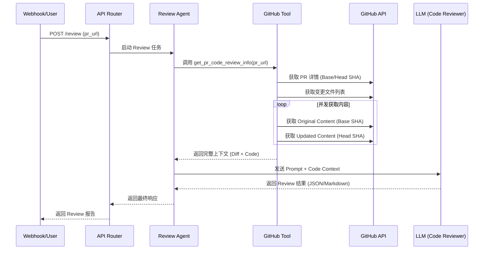

# GitHub PR AI Code Review 开发计划

本文档描述了实现 GitHub Pull Request 自动代码审查功能的详细开发计划。

---

## 1. 功能概述

系统将接收一个 GitHub PR 的 URL，自动获取该 PR 的所有变更文件信息（包括 Diff、原始内容、修改后内容），并利用 LLM 进行代码审查，最终输出结构化的审查建议（Findings）和 Markdown 格式的总结。

### 输入
-   `pull_request_url`: GitHub PR 的链接 (例如: `https://github.com/owner/repo/pull/123`)

### 输出

#### JSON 格式 (用于系统集成)
```json
{
    "findings": [
        {
            "filename": "src/main.py",
            "line_number": 42,
            "issue": "Potential SQL Injection",
            "suggestion": "Use parameterized queries instead."
        }
    ]
}
```

#### Markdown 格式 (用于人工阅读)
-   PR 变更摘要 (Summary)
-   问题列表表格 (Filename, Line, Issue, Suggestion)

---

## 2. 系统架构与流程图



---

## 3. 涉及文件与开发清单

| 模块 | 文件路径 | 状态 | 说明 |
| :--- | :--- | :--- | :--- |
| **Service** | `src/services/github_service.py` | ✅ 已完成 | 已实现 `get_pr_code_review_info` 方法，用于获取 PR 全量信息。 |
| **Tool** | `src/tools/github_tools.py` | ⏳ 待开发 | 需要新增 `get_pr_review_info_tool`，暴露给 Agent 使用。 |
| **Agent** | `src/agents/code_review_agent.py` | ⏳ 待开发 | **核心开发项**。定义 Prompt，组装 LLM 和 Tool。需要处理结构化输出 (JSON)。 |
| **API** | `src/routers/review_router.py` | ⏳ 待开发 | 新增 Webhook 接口，接收 PR URL 并调用 Agent。 |
| **Test** | `test/agents/test_code_review_agent.py` | ⏳ 待开发 | 端到端测试：Mock GitHub 数据或使用真实 PR，验证 Review 输出格式。 |

---

## 4. 详细开发步骤

### 步骤 1: 扩展 GitHub Tools
在 `src/tools/github_tools.py` 中添加新的 Tool：
-   **名称**: `get_pr_code_review_context`
-   **输入**: `repo_owner`, `repo_name`, `pull_number`
-   **功能**: 调用 `GitHubService.get_pr_code_review_info`。

### 步骤 2: 构建 Code Review Agent
在 `src/agents/code_review_agent.py` 中实现：
-   **Prompt 设计**:
    -   角色设定：资深代码审查员。
    -   任务：分析代码变更，寻找 Bug、安全漏洞、代码风格问题。
    -   **输出要求**: 必须严格遵循 JSON 格式，同时生成 Markdown 摘要。
-   **结构化输出**:
    -   考虑使用 LangChain 的 `with_structured_output` (如果模型支持) 或者 Pydantic Output Parser 来确保 JSON 格式的稳定性。

### 步骤 3: 编写测试
在 `test/agents/test_code_review_agent.py` 中：
-   调用 Agent。
-   验证输出是否包含 `findings` 列表。
-   验证输出是否包含 Markdown 表格。

### 步骤 4: API 接口实现 (可选/最后)
如果需要对外提供服务，实现 FastAPI 路由。
