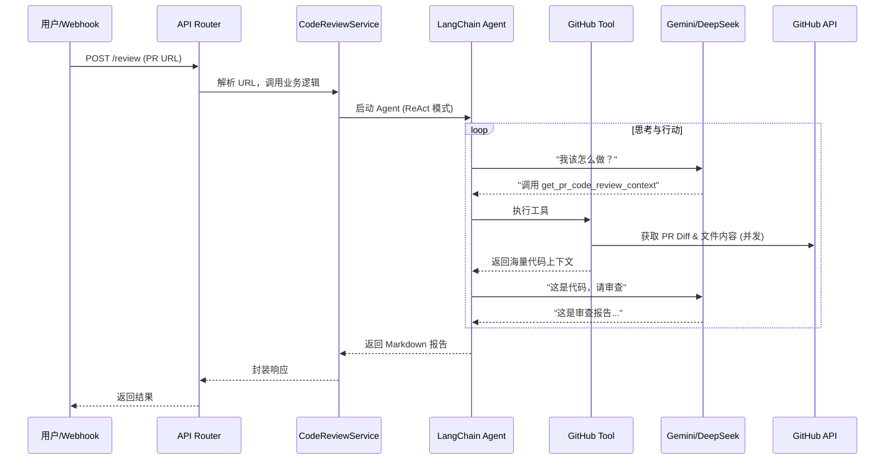

# 构建企业级 GitHub AI Code Review Agent 全指南

本文档是对 `py-github-agent` 项目中 Code Review Agent 功能构建过程的详尽复盘。它不仅包含所有核心代码，还深入解析了设计决策、遇到的坑以及解决方案。

---

## 1. 架构概览

我们的目标是构建一个能够自动审查 GitHub Pull Request (PR) 的 AI 智能体。

### 系统数据流


---

## 2. 基础服务层 (Foundation)

一切始于数据的获取。我们需要一个强大的 Service 来与 GitHub 交互。

### 2.1 GitHub Service (`src/services/github_service.py`)

这个类负责所有的 GitHub API 调用。最核心的难点在于**高效获取 PR 的全量信息**（不仅是 Diff，还有完整的文件内容以便上下文理解）。

```python
import os
import asyncio
import aiohttp
from loguru import logger
from typing import List, Dict, Any

# ... (省略部分导入)

class GitHubService:
    BASE_URL = "https://api.github.com"

    def __init__(self, token: str = None):
        # 优先从参数获取 token，否则从环境变量获取
        # 这在测试和生产环境中提供了灵活性
        self.token = token or os.getenv("GITHUB_TOKEN")
        if not self.token:
            logger.warning("GITHUB_TOKEN not found...")
        
        self.headers = {
            "Accept": "application/vnd.github.v3+json",
            "X-GitHub-Api-Version": "2022-11-28",
        }
        if self.token:
            self.headers["Authorization"] = f"token {self.token}"

    async def _fetch_file_content(self, session: aiohttp.ClientSession, repo_owner: str, repo_name: str, path: str, ref: str) -> str:
        """
        辅助方法：获取指定 commit (ref) 下的单个文件内容。
        使用 'application/vnd.github.v3.raw' 头可以直接获取原始内容，无需 Base64 解码。
        """
        url = f"{self.BASE_URL}/repos/{repo_owner}/{repo_name}/contents/{path}"
        params = {"ref": ref}
        headers = self.headers.copy()
        headers["Accept"] = "application/vnd.github.v3.raw"
        
        try:
            async with session.get(url, params=params, headers=headers) as response:
                if response.status == 404:
                    return "" # 文件可能被删除或不存在
                response.raise_for_status()
                return await response.text()
        except Exception as e:
            logger.error(f"Failed to fetch content for {path}: {e}")
            return ""

    async def get_pr_code_review_info(self, repo_owner: str, repo_name: str, pull_number: int) -> Dict[str, Any]:
        """
        【核心方法】获取 PR Review 所需的所有信息。
        关键点：使用 asyncio.gather 并发下载所有变更文件的新旧版本内容。
        """
        logger.info(f"Fetching PR info for {repo_owner}/{repo_name}#{pull_number}")
        
        try:
            async with aiohttp.ClientSession(headers=self.headers) as session:
                # 1. 获取 PR 详情，拿到 base_sha (修改前) 和 head_sha (修改后)
                pr_url = f"{self.BASE_URL}/repos/{repo_owner}/{repo_name}/pulls/{pull_number}"
                async with session.get(pr_url) as response:
                    response.raise_for_status()
                    pr_data = await response.json()
                
                base_sha = pr_data["base"]["sha"]
                head_sha = pr_data["head"]["sha"]
                
                # 2. 获取变更文件列表 (包含 patch/diff)
                files_url = f"{self.BASE_URL}/repos/{repo_owner}/{repo_name}/pulls/{pull_number}/files"
                async with session.get(files_url) as response:
                    response.raise_for_status()
                    files_data = await response.json()
                
                # 3. 并发获取内容 (这是性能优化的关键)
                tasks = []
                for file_info in files_data:
                    filename = file_info["filename"]
                    status = file_info["status"]
                    
                    # 根据文件状态决定是否需要下载原始内容
                    if status == "added":
                        original_task = asyncio.create_task(asyncio.sleep(0, result=""))
                    else:
                        original_task = self._fetch_file_content(session, repo_owner, repo_name, filename, base_sha)
                        
                    # 根据文件状态决定是否需要下载更新后内容
                    if status == "removed":
                        updated_task = asyncio.create_task(asyncio.sleep(0, result=""))
                    else:
                        updated_task = self._fetch_file_content(session, repo_owner, repo_name, filename, head_sha)
                        
                    tasks.append((file_info, original_task, updated_task))
                
                # 等待所有下载任务完成
                results = []
                for file_info, original_task, updated_task in tasks:
                    original_content = await original_task
                    updated_content = await updated_task
                    
                    results.append({
                        "filename": file_info["filename"],
                        "status": file_info["status"],
                        "diff_info": file_info.get("patch", ""), # Diff 片段
                        "original_content": original_content,
                        "updated_content": updated_content
                    })
                
                return {"changed_files": results}

        except Exception as e:
            logger.error(f"Error getting PR code review info: {e}")
            return {"changed_files": []}
```

---

## 3. 工具层 (Tools)

LangChain Agent 不能直接调用 Python 方法，需要封装成 `Tool`。

### 3.1 GitHub Tools (`src/tools/github_tools.py`)

```python
import asyncio
from typing import Type
from langchain_core.tools import BaseTool
from pydantic import BaseModel, Field
from src.services.github_service import GitHubService
from loguru import logger

github_service = GitHubService()

# 定义输入的 Schema，这是 LLM 理解如何调用工具的关键
class GetPrReviewContextInput(BaseModel):
    """Input for the get_pr_code_review_context tool."""
    repo_owner: str = Field(description="The owner of the GitHub repository.")
    repo_name: str = Field(description="The name of the GitHub repository.")
    pull_number: int = Field(description="The pull request number.")

class GetPrReviewContextTool(BaseTool):
    name: str = "get_pr_code_review_context"
    description: str = "Useful for getting full context (diff, original and updated code) of a pull request for code review."
    args_schema: Type[BaseModel] = GetPrReviewContextInput

    # 同步入口 (LangChain 可能会调用)
    def _run(self, repo_owner: str, repo_name: str, pull_number: int) -> dict:
        logger.info("Running GetPrReviewContextTool synchronously...")
        return asyncio.run(self._arun(repo_owner, repo_name, pull_number))

    # 异步入口 (我们要用的)
    async def _arun(self, repo_owner: str, repo_name: str, pull_number: int) -> dict:
        logger.info("Running GetPrReviewContextTool asynchronously...")
        return await github_service.get_pr_code_review_info(repo_owner, repo_name, pull_number)

# 实例化工具
get_pr_review_context_tool = GetPrReviewContextTool()
```

---

## 4. LLM 集成层 (Model Layer)

为了支持 Gemini 并解决特定的网络问题，我们进行了自定义封装。

### 4.1 自定义 Gemini 模型 (`src/llm/custom_gemini.py`)

```python
from langchain_core.language_models.chat_models import BaseChatModel
from langchain_google_genai import ChatGoogleGenerativeAI
# ... 其他导入

class CustomGeminiChatModel(BaseChatModel):
    def __init__(self, **kwargs: Any):
        super().__init__(**kwargs)
        # ... API Key 获取 ...
        
        # 核心配置：transport="rest"
        # 这是为了解决在某些网络代理环境下，gRPC 协议连接卡死的问题。
        self.client = ChatGoogleGenerativeAI(
            model=self.model_name,
            google_api_key=api_key,
            temperature=self.temperature,
            transport="rest", 
            **kwargs
        )

    # 实现 _generate 代理调用
    def _generate(self, messages, ...):
        llm_result = self.client.generate([messages], ...)
        return ChatResult(generations=llm_result.generations[0])

    # 关键修复：实现 _astream
    # 如果不实现这个方法，LangChain 会回退到非流式模式，导致没有“打字机”效果。
    async def _astream(self, messages, ...):
        async for chunk in self.client.astream(messages, ...):
            # 必须将原始 chunk 包装在 ChatGenerationChunk 中
            yield ChatGenerationChunk(message=chunk)
```

### 4.2 模型工厂 (`src/llm/factory.py`)

支持通过配置动态切换 DeepSeek 和 Gemini。

```python
def get_llm() -> BaseChatModel:
    provider = yaml_configs.get("llm", {}).get("provider", "gemini")
    if provider == "deepseek":
        from .custom_deepseek import CustomDeepSeekChatModel
        return CustomDeepSeekChatModel()
    else:
        from .custom_gemini import CustomGeminiChatModel
        return CustomGeminiChatModel()
```

---

## 5. Agent 实现 (The Brain)

这是最核心的逻辑部分，定义了 AI 如何思考。

### 5.1 Code Review Agent (`src/agents/code_review_agent.py`)

```python
from langchain_classic.agents import initialize_agent, AgentType
# ...

# 精心设计的 System Prompt
CODE_REVIEW_PROMPT = """You are an expert Senior Software Engineer and Code Reviewer.
Your task is to review a GitHub Pull Request based on the provided context...

1. First, use the `get_pr_code_review_context` tool...
2. Analyze the changes carefully...
3. Construct a structured review report.

**CRITICAL: OUTPUT FORMAT INSTRUCTIONS**
You MUST output the report in the following Markdown format:
## Code Review Report
### Summary
...
### Detailed Findings
| Filename | Line Number | Issue | Suggestion |
...
"""

def create_code_review_agent() -> Runnable:
    tools = [get_pr_review_context_tool]
    llm = get_llm()

    # 使用 initialize_agent (ReAct 模式)
    # 选择 STRUCTURED_CHAT_ZERO_SHOT_REACT_DESCRIPTION 以支持复杂的工具输入
    agent_executor = initialize_agent(
        tools=tools,
        llm=llm,
        agent=AgentType.STRUCTURED_CHAT_ZERO_SHOT_REACT_DESCRIPTION,
        verbose=True,
        handle_parsing_errors=True, # 允许 Agent 在输出格式错误时自我修正
        agent_kwargs={
            "prefix": CODE_REVIEW_PROMPT # 注入我们的 Prompt
        }
    )
    return agent_executor
```

---

## 6. 应用层 (Application Layer)

将 Agent 包装成 API 服务。

### 6.1 Service (`src/services/code_review_service.py`)

```python
class CodeReviewService:
    def __init__(self, agent_executor: Runnable):
        self.agent_executor = agent_executor

    async def perform_code_review(self, pr_url: str) -> str:
        # 1. 解析 URL 提取 owner/repo/number
        pr_info = self.parse_pr_url(pr_url)
        
        # 2. 构造自然语言指令给 Agent
        input_text = f"Please review pull request #{pr_info['pull_number']}..."
        
        # 3. 调用 Agent
        result = await self.agent_executor.ainvoke({"input": input_text})
        return result.get("output", "")
```

### 6.2 Router (`src/routers/review_router.py`)

```python
@router.post("", response_model=CodeReviewResponse)
async def create_code_review(
    request: CodeReviewRequest,
    service: CodeReviewService = Depends(get_review_service)
):
    # 调用 Service 并返回结果
    result = await service.perform_code_review(request.pull_request_url)
    return CodeReviewResponse(review_report=result)
```

---

## 7. 部署配置 (DevOps)

为了让应用在 GKE 上安全运行，我们需要处理密钥注入。

### 7.1 Cloud Build (`cloudbuild-helm.yaml`)

```yaml
steps:
  # ...
  - id: "Deploy to GKE"
    # ...
    # 关键步骤：从 Secret Manager 获取 API Key
    GEMINI_API_KEY=$$(gcloud secrets versions access latest --secret=gemini-api-key ...)
    
    # 将 Key 作为参数传递给 Helm
    ./linux-amd64/helm upgrade ... \
      --set-string geminiApiKey="$$GEMINI_API_KEY" \
      ...
```

### 7.2 Helm Deployment (`helm/templates/deployment.yaml`)

```yaml
    spec:
      containers:
        - name: {{ .Values.service.appName }}
          env:
            # 将 Helm 传入的值设置为环境变量
            - name: GEMINI_API_KEY
              value: {{ .Values.geminiApiKey | quote }}
```

通过这套完整的流程，我们实现了一个既可以在本地调试（使用 `.env`），又可以在云端安全运行（使用 Secret Manager）的生产级 AI Code Review Agent。
