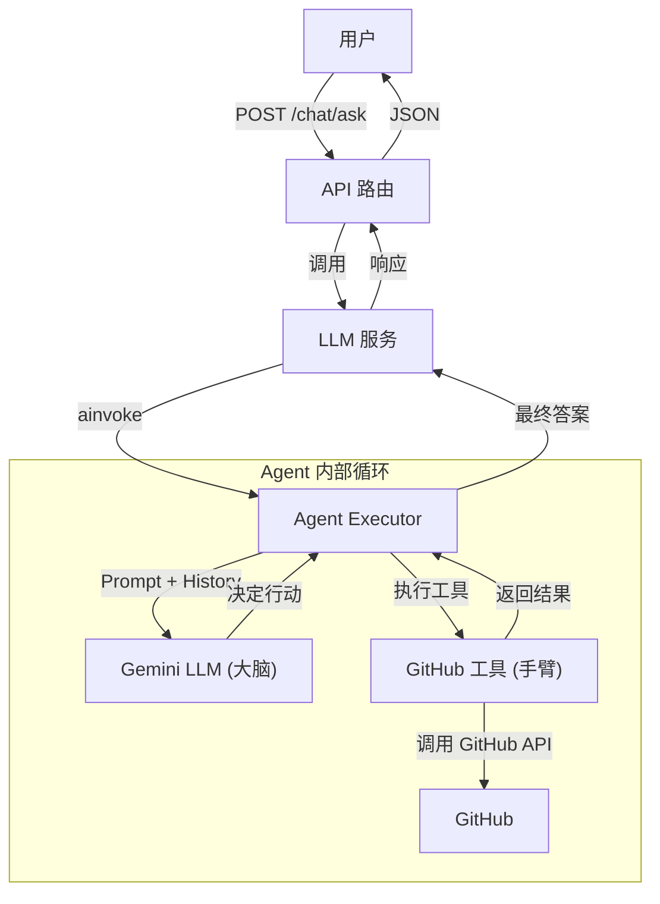

# GitHub AI Agent 实现指南

本文档详细记录了我们在 `py-github-agent` 项目中如何从零开始构建一个能够与 GitHub 交互的 AI Agent。

---

## 1. 系统架构

我们的 Agent 遵循模块化设计原则，主要由以下几层组成：



---

## 2. 核心代码实现与解析

### 2.0. 基础服务层 (The Foundation)

在构建 Agent 工具之前，我们首先实现了一个底层的 `GitHubService`，用于直接与 GitHub API 交互。

**文件**: `src/services/github_service.py`

```python
class GitHubService:
    BASE_URL = "https://api.github.com"

    def __init__(self, token: str = None):
        # 从环境变量读取 GITHUB_TOKEN
        self.token = token or os.getenv("GITHUB_TOKEN")
        # ... 设置 headers ...

    async def _make_request(self, url: str, params: Dict = None) -> Any:
        """封装 aiohttp 请求，处理基本的错误和状态检查"""
        try:
            async with aiohttp.ClientSession(headers=self.headers) as session:
                async with session.get(url, params=params) as response:
                    response.raise_for_status()
                    return await response.json()
        except Exception as e:
            logger.error(f"Error making request to {url}: {e}")
            return None

    async def get_all_files_list(self, repo_owner: str, repo_name: str, branch: str = "main") -> List[str]:
        """
        高效获取仓库所有文件列表。
        使用 GitHub Git Trees API 的 recursive=1 参数。
        """
        # 直接调用 Git Trees API，避免多次请求
        url = f"{self.BASE_URL}/repos/{repo_owner}/{repo_name}/git/trees/{branch}?recursive=1"
        
        tree_data = await self._make_request(url)
        
        # 过滤出文件（blob），忽略目录（tree）
        file_paths = [item["path"] for item in tree_data["tree"] if item.get("type") == "blob"]
        return file_paths
```

**解析**：
-   **异步通信**: 使用 `aiohttp` 库实现全异步的 HTTP 请求，确保在高并发下的性能。
-   **高效 API**: 利用 GitHub 的 Git Trees API (`recursive=1`)，仅需一次 HTTP 请求即可获取整个仓库的文件结构，避免了递归遍历目录所需的多次请求。

### 2.1. 工具层 (The Arms)

有了基础服务后，我们需要将其封装为 Agent 可以理解的 `Tool`。

**文件**: `src/tools/github_tools.py`

```python
# 定义输入参数的 Schema，这对 LLM 理解工具至关重要
class ListRepoFilesInput(BaseModel):
    """Input for the list_repository_files tool."""
    repo_owner: str = Field(description="The owner of the GitHub repository.")
    repo_name: str = Field(description="The name of the GitHub repository.")
    branch: str = Field(description="The branch to list files from.", default="main")

class ListRepoFilesTool(BaseTool):
    name: str = "list_repository_files"
    description: str = "Useful for listing all file paths in a specific branch of a GitHub repository."
    args_schema: Type[BaseModel] = ListRepoFilesInput

    # 实际执行逻辑：调用底层的 GitHubService
    async def _arun(self, repo_owner: str, repo_name: str, branch: str = "main") -> List[str]:
        logger.info("Running ListRepoFilesTool asynchronously...")
        return await github_service.get_all_files_list(repo_owner, repo_name, branch)
```

**解析**：
-   我们继承了 `BaseTool`。
-   `args_schema` 和 `description` 是最关键的。LLM 会读取这些信息来决定是否调用此工具，以及如何提取参数。

### 2.2. 模型层 (The Brain)

我们需要一个能够进行逻辑推理的 LLM。我们封装了 Google Gemini。

**文件**: `src/llm/custom_gemini.py` (部分展示)

```python
class CustomGeminiChatModel(BaseChatModel):
    def __init__(self, **kwargs: Any):
        # ... 初始化代码 ...
        # 关键配置：强制使用 REST 传输以适应代理环境
        self.client = ChatGoogleGenerativeAI(
            model="gemini-2.5-pro",
            transport="rest",  # <-- 解决网络卡顿的关键
            **kwargs
        )
    
    # 必须实现 _generate 方法供 LangChain 调用
    def _generate(self, messages, ...):
        llm_result = self.client.generate([messages], ...)
        return ChatResult(generations=llm_result.generations[0])
```

**解析**：
-   我们创建了一个自定义类来统一管理 API Key 和网络配置（如 `transport="rest"`）。
-   它继承自 `BaseChatModel`，这使得它可以无缝集成到 LangChain 的任何组件中。

### 2.3. Agent 组装 (The Assembly)

我们将 LLM 和工具组装成一个可以运行的 Agent。

**文件**: `src/agents/github_agent.py`

```python
def create_github_agent() -> Runnable:
    # 1. 准备工具箱
    tools = [list_repo_files_tool]
    
    # 2. 准备大脑
    llm = CustomGeminiChatModel(temperature=0) # 0温度保证输出精确

    # 3. 准备系统提示词 (System Prompt)
    # 这是一个 ReAct 风格的 Prompt，指导 LLM 如何思考
    prompt = ChatPromptTemplate.from_messages([...])

    # 4. 创建 Agent (大脑 + 工具 + 提示词)
    agent = create_tool_calling_agent(llm, tools, prompt)

    # 5. 创建执行器 (身体)
    # AgentExecutor 负责运行 Agent 的思考-行动循环
    agent_executor = AgentExecutor(
        agent=agent,
        tools=tools,
        verbose=True, # 开启日志以便调试
        handle_parsing_errors=True
    )

    return agent_executor
```

**解析**：
-   这个工厂函数返回一个 `AgentExecutor`。
-   `AgentExecutor` 是一个实现了 `Runnable` 接口的对象，这意味着它可以像普通函数一样被调用。

### 2.4. 服务层与 API (The Interface)

最后，我们将 Agent 暴露给外部世界。

**文件**: `src/services/llm_service.py`

```python
class LLMService:
    # 这里的 runnable 可以是 LLM，也可以是 AgentExecutor
    def __init__(self, runnable: Runnable):
        self.runnable = runnable

    async def ainvoke(self, prompt: str):
        # 统一调用入口
        return await self.runnable.ainvoke(prompt)
```

**文件**: `src/routers/chat_router.py`

```python
@router.post("/ask", response_model=AskResponse)
async def ask(
    request: AskRequest,
    llm_service: LLMService = Depends(get_llm_service)
):
    # 处理 HTTP 请求，调用 Service
    response = await llm_service.ainvoke(request.query)
    return AskResponse(answer=response['output'])
```

---

## 3. 总结

通过这一系列步骤，我们实现了一个灵活且强大的架构：

1.  **模块化**：工具、模型、代理逻辑完全分离。
2.  **可扩展性**：如果想添加新功能（如读取文件内容），只需在 `github_tools.py` 中添加新工具，并在 `github_agent.py` 的列表中注册即可。
3.  **统一接口**：通过 `Runnable` 接口和 `LLMService`，上层应用不需要知道底层是简单的 LLM 还是复杂的 Agent。

## 4. 验证结果

以下是运行集成测试 `test/agents/test_github_agent.py` 的真实输出日志。可以看到 Agent 成功理解了自然语言指令，调用了工具，并返回了正确的文件列表。

```text
2025-11-29 21:17:55.280 | INFO     | test_github_agent:test_github_agent_via_llm_service:29 - Invoking agent with prompt: 'Can you list all the files in the 'nvd11/py-github-agent' repository?'
2025-11-29 21:17:55.280 | INFO     | src.services.llm_service:ainvoke:12 - LLMService ainvoking with prompt: {'input': "Can you list all the files in the 'nvd11/py-github-agent' repository?"}


> Entering new AgentExecutor chain...
Action:
```json
{
  "action": "list_repository_files",
  "action_input": {
    "repo_owner": "nvd11",
    "repo_name": "py-github-agent"
  }
}
```
2025-11-29 21:17:59.438 | INFO     | src.tools.github_tools:_arun:32 - Running ListRepoFilesTool asynchronously...
2025-11-29 21:17:59.438 | INFO     | src.services.github_service:get_all_files_list:77 - Fetching file list for nvd11/py-github-agent on branch main
2025-11-29 21:17:59.987 | SUCCESS  | src.services.github_service:get_all_files_list:93 - Successfully fetched 44 file paths.

Observation: ['.dockerignore', '.gitignore', '.vscode/launch.json', '.vscode/settings.json', 'Dockerfile', 'README.md', 'cloudbuild-helm.yaml', 'cloudbuild_cloudrun.yaml', 'docs/LANGCHAIN_MODEL_GUIDE.md', 'docs/TROUBLESHOOTING.md', 'docs/agent.md', 'docs/get-files-agent.md', 'gateway_routing_explained.md', 'get_helm.sh', 'helm/Chart.yaml', 'helm/templates/deployment.yaml', 'helm/templates/service.yaml', 'helm/values.yaml', 'k8s/gateway.yaml', 'k8s/httproute.yaml', 'pytest.ini', 'requirements.txt', 'server.py', 'src/configs/__init__.py', 'src/configs/config.py', 'src/configs/config_dev.yaml', 'src/configs/config_local.yaml', 'src/configs/config_prod.yaml', 'src/configs/log_config.py', 'src/configs/proxy.py', 'src/llm/custom_deepseek.py', 'src/llm/custom_gemini.py', 'src/llm/factory.py', 'src/llm/gemini_client.py', 'src/main.py', 'src/routers/chat_router.py', 'src/schemas/chat_schemas.py', 'src/services/github_service.py', 'src/services/llm_service.py', 'test.py', 'test/services/test_github_service.py', 'test/services/test_llm_service.py', 'test/test_1.py', 'test/test_gemini.py']
Thought:This is the full list of files in the `nvd11/py-github-agent` repository:

*   .dockerignore
*   .gitignore
*   .vscode/launch.json
*   .vscode/settings.json
*   Dockerfile
*   README.md
*   ... (文件列表省略) ...

> Finished chain.
2025-11-29 21:18:04.758 | INFO     | src.services.llm_service:ainvoke:14 - LLMService ainvocation complete.
2025-11-29 21:18:04.759 | SUCCESS  | test_github_agent:test_github_agent_via_llm_service:73 - Agent finished with final answer:
This is the full list of files in the `nvd11/py-github-agent` repository:
...
```
